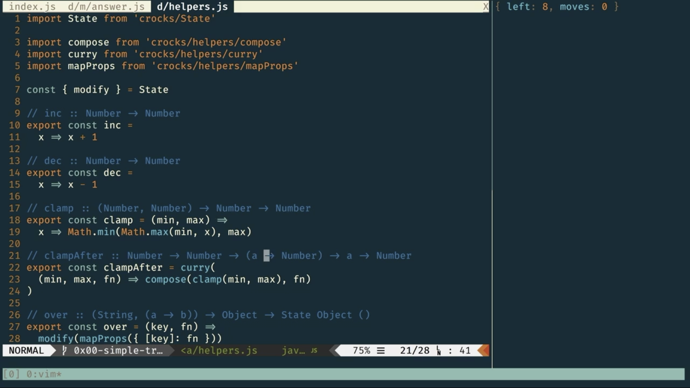
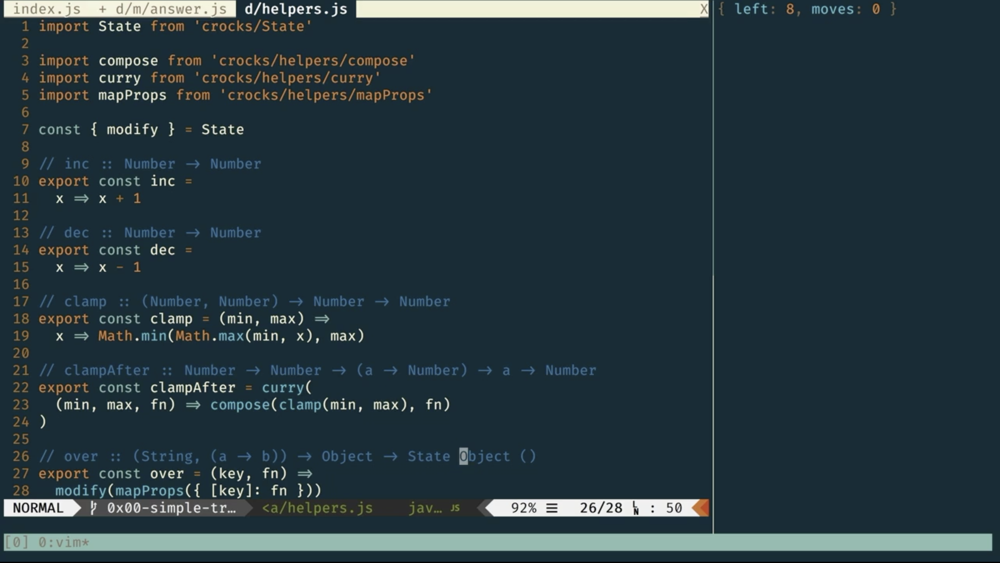

We have two attributes in our state. The first represents the number of moves `left`, while the second tracks the number of `moves` the player has made. Here, we're just kenny-loggings our `state` to the console on the right.

#### index.js
```js
import log from './logger'

const state = {
  left: 8, 
  moves: 0,
}

log(state)
```

Let's start building out some transactions in our answer model. We'll start by creating a limiting function that will keep stray values in check. We'll call it `limitMoves`. `limitMoves` is defined as a function that takes a function from `a -> Number` as its first argument, giving back another function that takes an `a -> Number`. To implement, we'll reach for this `clampAfter` helper, applying `0` and `8` is its arguments. 

#### data/model/answer.js
```js
import {
  clampAfter, dec, inc, over
} from '../helpers'

// limitMoves :: (a -> Number) -> a -> Number

const limitMoves = 
  clampAfter(0, 8)
```

Then we'll just pop over to helpers and see what it does. Looking at the siggie, we see our first two numbers followed by the `a -> Number` function, then the same `a -> Number` function from `limitMoves`. We take a `min` and a `max` value followed by a `fn` and return a composition that runs that `fn`, passing the result to a clamping function, thus limiting our number. 



We'll export our first transaction that will decrement our moves `left` when the player performs a move. We define our brand-new `decLeft` to be a function that goes from a unit to a state fixed to our `appState` with a unit in the resultant. To implement, we first take our unit as input. Then we'll lean on this over helper to decrement over our left attribute using `limitMoves`, which we preload with this `dec` helper.

```js
import {
  clampAfter, dec, inc, over
} from '../helpers'

// limitMoves :: (a -> Number) -> a -> Number

const limitMoves = 
  clampAfter(0, 8)

// decLeft :: () -> State AppState ()
export const decLeft = () => 
  over('left', limitMoves(dec))
```

Over can be thought of as a targeted mini-reducer for applying a function over a state attribute. It takes a pair of `String` function and then an object returning a `State Object` of unit. Using the `key` and `fn`, we build an object that partially applies `mapProps` to be used with our state's modify `fn`.



In this case, the function we're going to apply is this `dec` function. It takes a number to number and just subtracts one from our input, returning the result. After a quick save, we'll take this for a spin by importing it into our `index.js` file by referencing `decLeft` from our file, which we pull from the path `./data/model/answer`, from which it was exported from.

#### index.js
```js
import log from './logger'

import { decLeft} from './data/model/answer'

const state = {
  left: 8, 
  moves: 0,
}

log(state)
```

With another quick save, we take a stroll downstairs and log out a call to `decLeft`, calling it with unit. We see we get back a state instance. We run the instance with `execWith`, passing it our initial `state`. We see that left has indeed been decremented.

#### output
```txt 
{ left: 6, moves: 0 }
```

```js
import log from './logger'

import { decLeft} from './data/model/answer'

const state = {
  left: 8, 
  moves: 0,
}

log(
  decLeft()
    .execWith(state)
)
```

#### output
```txt 
{ left: 0, moves: 0 }
```
We can `.chain` in another call to `decLeft` to decrement again. Because of our clamps -- insert "Futurama" reference -- we can chain so much and never go below zero. 

#### output
```txt 
{ left: 0, moves: 0 }
```

```js
log(
  decLeft()
    .chain(decLeft)
    .chain(decLeft)
    .chain(decLeft)
    .chain(decLeft)
    .chain(decLeft)
    .chain(decLeft)
    .chain(decLeft)
    .chain(decLeft)
    .chain(decLeft)
    .chain(decLeft)
    .execWith(state)
)
```

We can even start at a `0` state and be assured that we'll only have the values within the range we desire, no matter how it's called.

```js
import log from './logger'

import { decLeft} from './data/model/answer'

const state = {
  left: 0, 
  moves: 0,
}

log(
  decLeft()
    .execWith(state)
)
```

With `decLeft` in the bag, we'll reset our initial state and do something similar for our moves attribute, so similar in fact that we'll copypasta `decLeft` and then update the name, the function used with `limitMoves`, and the key we want to modify.We rename it to `incMoves` in both the signature and the actual function name. Change left to `moves`. Finally, replace dec with `inc`.

#### data/model/answer.js
```js
import {
  clampAfter, dec, inc, over
} from '../helpers'

// limitMoves :: (a -> Number) -> a -> Number

const limitMoves = 
  clampAfter(0, 8)
 
// decLeft :: () -> State AppState ()
export const decLeft = () => 
  over('left', limitMoves(dec))

// incMoves :: () -> State AppState ()
export const incMoves = () => 
  over('moves', limitMoves(inc))
```

In order to test this, in our index file, we swap out `decLeft` with `incMoves` in our import statement, as well as down below in our logging function, and observe our `moves` being incremented.

#### output
```txt 
{ left: 7, moves: 0 }
```

#### index.js
```js
import log from './logger'

import { incMoves} from './data/model/answer'

const state = {
  left: 8, 
  moves: 0,
}

log(
  incMoves()
    .execWith(state)
)
```

Just like `decLeft`, we can chain `incMoves` and get the expected behavior for one chain or by chaining as many as we want without any worry about these values stepping outside of our desired limits.