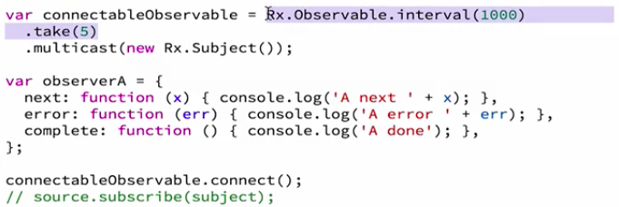

Now that we know all of the variants of subjects, let's go back and remember why did we need subjects in the first place? Originally, we had one typical observable, but we wanted two observers A and B, to see the same execution of that observable.

Because a `subscribe` on an observable will invoke the execution of that observable, we can only have one `subscribe` to this observable in this code. That's why we used here the `subject`, **because it's a hybrid between an observable and an observer**. Because it's an observer, we can use it here.

**jsbin**
```javascript
observable.subscribe(subject);
```

Then if we add observers to this `subject` like this, then they will see the same execution that's running in this `subject`.

**jsbin**
```javascript
subject.subscribe(observerA);
```

Does that mean that every time that we want to have multiple observers we need to set up a `subject`, and `subscribe` to the observables, `subscribe` to the subjects?

This system is not so ergonomic to set up. That's why there exists an operator or a method that simplifies all of this for us. That would be `multicast`. `multicast` is an operator on a normal observable. It takes here an argument, which is a `subject`.

**jsbin**
```javascript
var observable = Rx.observable.interval(1000)
  .take(5)
  .multicast(subject);
```

We could have passed, for instance, this `subject` that we created. We create that `subject`, and we can pass that as an argument to the `multicast`. Or actually, we could just directly pass that new constructed `subject` as an argument here, like that.

**jsbin**
```javascript
var observable = Rx.observable.interval(1000)
  .take(5)
  .multicast(new Rx.Subject());
```

Then the `subject` doesn't exist anymore. We need to comment out that. The `multicast` will actually return a so-called `connectableObservable`. It's slightly different to a normal observable. That's what we need to use here and here.

**jsbin**
```javascript
var connectableObservable = Rx.Observable.interval(1000)
  .take(5)
  .multicast(new Rx.Subject());

var observerA = {
  next: function (x) { console.log('A next ' + x); },
  error: function (err) { console.log('A error ' + err); },
  complete: function () { console.log('A done'); },
};

// observable.subscribe(subject);

connectableObservable.subscribe(observerA);

var observerB = {
  next: function (x) { console.log('B next ' + x); },
  error: function (err) { console.log('B error ' + err); },
  complete: function () { console.log('B done'); },
};

setTimeout(function () {
  connectableObservable.subscribe(observerB);
}, 2000);
```

Basically, we're adding the observer to the `connectableObservable`. A `connectableObservable` is an observable. It has all the normal methods of an observable, but it has a special property that it's backed by a `subject`, that is this `subject` that we pass here.

**jsbin**
```javascript
var connectableObservable = Rx.Observable.interval(1000)
  .take(5)
  .multicast(new Rx.Subject());
```

It's called connectable, because it has one special method which is called `connect`. What does `connect` do? It actually does essentially this behavior here. 

**jsbin**
```javascript
// observable.subscribe(subject);
```

When we call `connectableObservable.connect();`, what we're doing is that we're going to use the internal `subject` that the `connectableObservable` has, and we're going to `subscribe` that `subject` to the original observable.

When you say `connect`, you're essentially saying, invoke the execution of this observable, backed by the `subject` that we created here. It's really doing this, where source here is equivalent to this part here.



It will `subscribe` to that source using the internal `subject` that it is backed by. `connect` essentially says, start this whole execution for me. Then we can add observers to this `connectableObservable` here. These subscribes will not actually invoke the execution.

**jsbin**
```javascript
connectableObservable.subscribe(observerA);
```

They are really analogous to doing `subject.subscribe`. It's the same code that we had before. It's just that we are hiding the `subject` behind this `connectableObservable`. If we run this, it actually does the same thing as before. A sees zero, one, and two, and then B arrives late. B sees the same thing that A sees.

**Console Output**
```javascript
"A next 0"
"A next 1"
"B next 0"
"B next 1"
"A next 2"
"B next 2"
"A next 3"
"B next 3"
"A next 4"
"B next 4"
"A done"
"B done"
```

The takeaway is that with `multicast`, we can hide the `subject` that is used to share this execution inside this so-called `connectableObservable`. We can just `subscribe` to the observable normally, as we would with any other observable.

**jsbin**
```javascript
var connectableObservable = Rx.Observable.interval(1000)
  .take(5)
  .multicast(new Rx.Subject());

var observerA = {...};

connectableObservable.connect();

connectableObservable.subscribe(observerA);
```

Then we use `connect` to essentially say when to start running this execution. In fact, if we comment this out, we're basically not subscribing to this original source observable at all. It means that nothing will actually happen.

**jsbin**
```javascript
var connectableObservable = Rx.Observable.interval(1000)
  .take(5)
  .multicast(new Rx.Subject());

var observerA = {...};

// connectableObservable.connect();

connectableObservable.subscribe(observerA);
```

**It's with connect that we're able to manually invoke when to start that execution of the observable**. Because here in the `multicast` is the only place where we say which `subject` are we using to back this `connectableObservable`, we can actually replace this with any other type of `subject`, such as a `ReplaySubject`, for instance.

**jsbin**
```javascript
var connectableObservable = Rx.Observable.interval(1000)
  .take(5)
  .multicast(new Rx.ReplaySubject(100));
```

Now when we `connect` this observable, this `connectableObservable`, it will use a `ReplaySubject` to `subscribe` to this observable. That means that when the late observer arrives here, it will see the last values replayed to it. If we run this B arrives late, but B sees the latest values, zero and one, for instance.

**Console Output**
```javascript
"A next 0"
"A next 1"
"B next 0"
"B next 1"
"A next 2"
"B next 2"
"A next 3"
"B next 3"
"A next 4"
"B next 4"
"A done"
"B done"
```

This is how with `multicast`, we can keep writing code in a chainable style, where we do one operation, and then the other. We can also get rid of some boilerplate whenever we want to share an execution to multiple observers.