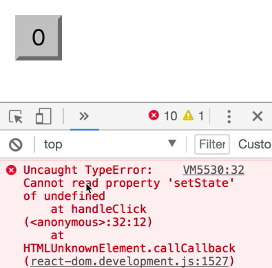

Here we have a `class Counter` that `extends React.Component`. Inside the `constructor`, we're forwarding along all the arguments, `...args` to `super` and then initializing our `state` with `{count: 0}`. Then in our `render`() method, we just render a `<button>` that has an `onClick` that updates our `state` to increment the `count`. Then it renders our state inside the button.

```javascript
class Counter extends React.Component {
    constructor(...args) {
        super(...args)
        this.state = {count: 0}
    }
    render() {
        return (
            <button 
                onClick={() =>
                    this.setState(({count}) => ({
                        count: count +1 ,
                    }))}
            >
                {this.state.count}
            </button>
        )
    }
}
```

This is totally fine to have an arrow function on our `onClick`, but sometimes it can get a little bit big. In some cases, it can actually be a performance bottleneck. So we're going to go ahead and extract that. We'll call this `handleClick()` on our `class` here. We're just going to pull `this.setState` out to our `handleClick`. Then we'll say `this.handleClick`. 

```javascript
class Counter extends React.Component {
    constructor(...args) {
        super(...args)
        this.state = {count: 0}
    }
    handleClick() {
        this.setState(({count}) => ({
            count: count +1 ,
        }))
    }
    render() {
        return (
            <button onClick={this.handleClick}>
                {this.state.count}
            </button>
        )
    }
}
```

I'll save it.

We'll see that it actually is broken. If I pop open my developer tools, we're going to get this error message every single time saying, "Cannot read property. Set state of undefined." 



The line that this is breaking on is `this.setState` where we're calling set `state` on `this`. The problem is pretty fundamental in JavaScript.

Let's take an example here. If I were to make a `var Bob` object and this has a `name: Bob` and `greet` that accepts a `name`, then we `return 'Hi ${name}, my name is ${this.name}!'` Then we close off that object. Then we say `Bob.greet('Jane')`.  

```javascript
var Bob = {
    name: 'Bob',
    greet(name) {
        return `Hi ${name}, my name is ${this.name}!`
    }
}

Bob.greet('Jane')
```
This will output, "Hi, Jane, my name is Bob!"

What we're doing here though is we're passing `onClick` this reference to this function. So let's go ahead and get a reference to `bob.greet` with the `greetFn` function equals `bob.greet`.

Then later on, React is going to come around and call the function that we've passed it. Let's go ahead and do `greetFn` function. We'll call it with `'Jane'`. 

```
var greetFn = bob.greet
greetFn('Jane')
```

We're going to get, "Hi, Jane, my name is !" That's because when this function called, `this` is not referencing our object `bob`.

We can get around this problem in JavaScript by instead assigning `this` to bind `bob`. Now `this` will always be referencing our `bob` function. If we call `greetFn` again, we're going to see, "Hi, Jane. My name is Bob!" We can solve this problem by calling `.bind` with `this`. 

```html
...
render() {
    return (
        <button 
            onClick={this.handleClick.bind(this)}>
                {this.state.count}
        </button>
    )
}
```

We save. Now our functionality is totally working.


That's great. It cleans up our `render` function a little. But it's kind of annoying to have to call `.bind`. It also actually is still performance bottleneck in some situations which would be nice to avoid. What we can do is, inside of our `constructor`, say `this.handleClick`. We reference `this.handleClick` which actually is pointing to the prototypal method. We're going to actually reassign this to `this.handleClick.bind(this)`. 

```javascript
class Counter extends React.Component {
    constructor(...args) {
        super(...args)
        this.state = {count: 0}
        this.handleClick = this.handleClick.bind(this)
    }
    ...
}
```

We're creating new function inside of our `constructor` and overriding the function that we have reference to from our prototype to a pre-bound method. Now we can just pass this without the bind, and everything works perfectly.

```html
render() {
    return (
        <button 
            onClick={this.handleClick}>
                {this.state.count}
        </button>
    )
}
```

That's better. We're getting rid of that performance bottleneck, but this is still super annoying, especially if you have a lot of these.

One really neat trick is we can actually use public class fields. Let's go ahead, and we'll remove `this.` from `state` and `handleClick` and move these down outside of the `constructor`. Now our `constructor` looks exactly like the default `constructor`, so we can get rid of that. This is using public class fields where we have the name of the field and then the assignment and then the value that it'll be assigned to.

```javascript
class Counter extends React.Component {
    state = {count: 0}
    handleClick = this.handleClick.bind(this)
    handleClick() {
        this.setState(({count}) => ({
            count: count + 1
        }))
    }
    ...
}
```

Now if we save this, everything else is working exactly as it was before. 


We've gotten rid of a little bit of boiler plate using public class fields. We can actually do a little bit better by not creating this `handleClick` method on the prototype at all and just having it on the instance. Here we can say, `handleClick = ` a function that we `.bind(this)`. 

```javascript
class Counter extends React.Component {
    state = {count: 0}
    handleClick() = function () {
        this.setState(({count}) => ({
            count: count + 1
        }))
    }.bind(this)
    ...
}
```

Everything is working yet again, just perfect.


But having this `bind` on here is super annoying also. So we're going to get rid of that and just use the lexical this that arrow functions give us. 

```javascript
class Counter extends React.Component {
    state = {count: 0}
    handleClick() = () => {
        this.setState(({count}) => ({
            count: count + 1
        }))
    }
    ...
}
```

Everything is working perfectly there too.


Now we've been able to clean up our `render` method and avoid a potential performance bottleneck by moving our event handler to the class body and using public class fields. We got rid of that `constructor`. We're using this public class field syntax. Then we're using an arrow function to avoid issues with using `this` inside of our event handler.