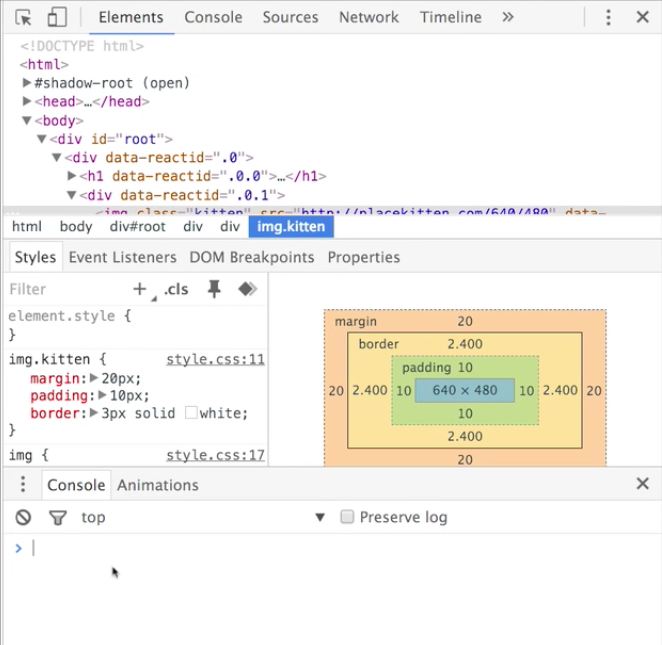
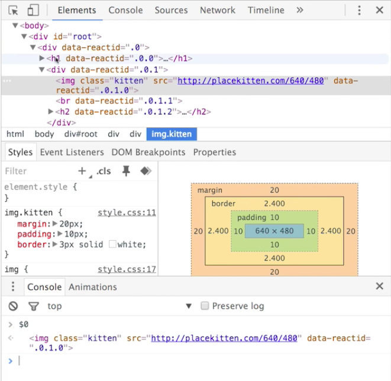
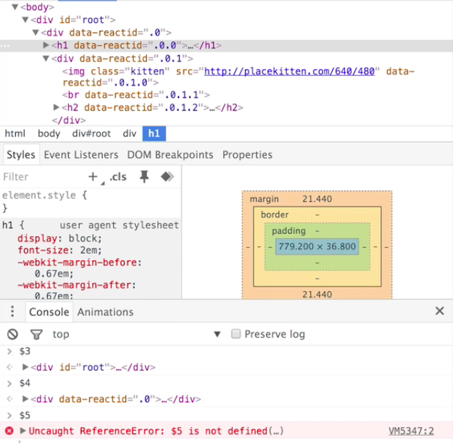
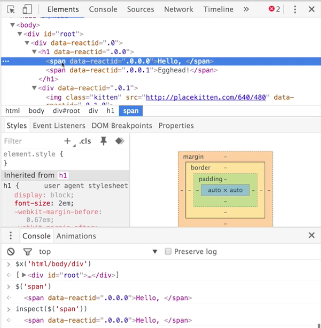

Another excellent feature of the Elements panel in the Chrome DevTools is that you can press Escape to open the console. This slides in as a third panel in addition to the structure and the style. It has some pretty special features.



You've noticed that as we click through here, we have, at any given time, a currently selected element within the structure here. Down here, that gives us the style for that currently selected element. In the console, anytime we press `$0`, that's going to give us a reference to that currently selected element.



This changes. As we change our currently selected element, the value of `$0` will change. This actually has a memory. If we press `$1`, it's whatever the previously selected element was. `$2`is the element before that. `$3` is the element before that. `$4` is the element before that. `$5` doesn't actually do anything.



You've got zero through four, so the five most recent elements are available to you as a stack. You can do things like treat them as an array here, whatever. If you're doing some kind of like console jockeying and you need to remember the stack of the things you've cared about, this is a great way to do that.

Of course, most of us are not going to be maintaining a stack-based approach. We're going to be digging through. We're going to be like, "OK, I got to find this image like when we find all images with the `class` `kitten`."

You're thinking, "Oh, crap. This was like if I had jQuery like I used to back before I discovered React, I'd be able to write a selector for kitten. Now, I have to remember the DOM. Oh, crap. How do I do that?" Don't worry about it.

Chrome actually does this cool thing for you, which is **even if you don't have jQuery, you can still use the $ with a selector pattern**. It's going to return a reference to that particular element.


Note, here in my code base, I have multiple spans. I've got a couple up here. I've got a couple down here inside of my headers.

If this were actually jQuery, then by saying this, I would get a collection of all of those spans. Instead, I'm only getting the first one that it finds. In order to get that collection, I need to use two dollar signs. That's going to return a list of all spans.


There is a third selector here, which is the `$x`. This is going to search for...You give it a jQuery path. Give me the `div` that is contained within the `body`, that is contained with the `html`, and that's going to work.


Because it's `$x`, that's always going to return a list of all nodes that match your selector even though you and I all know that in this instance, there's only the one div inside of the body, inside of the HTML.

Those are all various ways that you can get references to different nodes. You'll notice that just because I got a reference to a `span`, doesn't mean that I made that `span` selected. What I can do is call the `inspect` function on that reference. Now, I've actually told my Elements panel to select that.



From the console, we can both read and write to the state of the Elements panel. That's pretty powerful. There's one additional cool console command that they added. That has to do with monitoring events. This is getting into another panel here which there's a lot of stuff going on. Let's look at it from the console standpoint.

If we type `monitorEvents`, and then we give it a reference to some DOM nodes, let's create a reference here to `h1`. We're going to listen all click events. We've said `monitorEvents`. Every time somebody clicks on in `h1`, I want something to happen.

**Console Input**
```
monitorEvents($('h1'), 'click')
```

What's going to happen is we're getting this event. It's logging out to the console. This is for debugging. You're not mutating your code. You're not adding a cool event handler that's going to get wired back into your React application. **This is strictly for debugging**, but it can be super useful.

Anything that you get a reference to, you can listen for that event. You can do, maybe instead of the `h1`, we want to listen to anything with the `.kitten` `class`. We want to listen to `mouseover`. Now, whenever we get a `mouseover` image, we get that event fired.


Because we don't want to clog up our console with all the stuff, we also have the ability to `unmonitorEvents`. You give it the elements. What did we say? We said `h1`. Now, we're no longer going to get notified when we click here. We also want to unmonitor `.kitten`. Now, we're no longer getting notified there.

**Console Input**
```
unmonitorEvents($('h1'))
unmonitorEvents($('.kitten'))
```