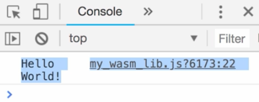

Instructor: 00:01 We start out by creating a new Rust library. 

#### Terminal
```bash
$ cargo new my-wasm-lib --lib
```

In our `Cargo.toml`, we set the create type to be `cdylib`, and add the dependency, `wasm-bindgen`. 

#### Cargo.toml
```toml
[lib]
crate-type = ["cdylib"]

[dependencies]
wasm-bindgen = "0.2
```

Right after that, we switch to our Rust `lib.rs` file and remove the existing code.

00:21 We declare that we use the `crate wasm-bindgen`, import the function `console.log`, and export the function `greet`, accepting a `name`. 

#### lib.rs
```rs
extern crate wasm_bindgen;

use wasm_bindgen::prelude:;*;

#[wasm_bindgen]
extern {
  #[wasm_bindgen(js_namespace = console)]
  fn log(msg: &str);
}

#[wasm_bindgen]
pub fn greet(name: &str) {
  log(&format!("Hello {}!", name));
}
```

Next up, we run `wasm-pack build`. Don't be surprised, this might take a couple minutes.

#### Terminal
```bash
$ wasm-pack build
```

00:45 This creates a package directory. In previous lessons, I mentioned that it contains a WASM and a Javascript file. What I haven't mentioned yet is that it also creates a `package.json` based on our `Cargo.toml`.

00:59 Using `wasm-pack publish`, 

```bash
$ wasm-pack publish
```

we can publish this package to NPM, and use it in any app supporting WASM. For example, a Rust webpack template. Keep in mind, you need to use wasm-pack login to log into NPM. I did this before I started the lesson.

01:21 Let's verify that this actually works. We switch over to our Rust webpack project and install our package, `my-wasm-lib`. 

```bash
$ npm install --save my-wasm-lib
$ npm start
```

Then we open the `index.js` file of our application, and add an import to our just-published library.

01:43 Once our libary's imported, we can import the `greet` function we previously exported. 

#### index.js
```js
import("my-wasm-lib").then(module => {
  module.greet("World");
})
```

In the browser, we now can see "Hello World." 



This means we can use any library using WebAssembly in our code, as well as we can publish our own using wasm-pack.